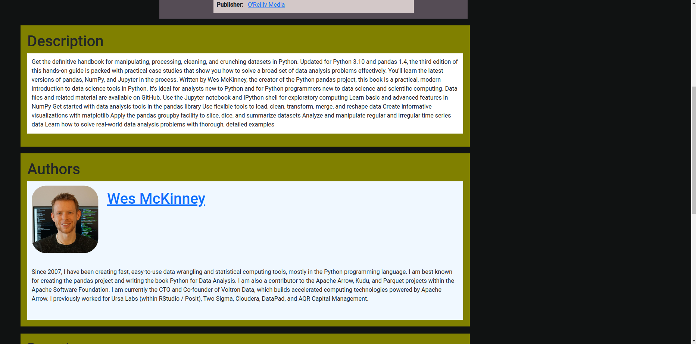

# Library

<h3>Fullstack application written in Java and Angular</h3>  

## Features
- <b>Frontend</b>
  - Admin component
  - User profile component
  - Searching books component
  - User book reactions component
  - Basket component

- <b>Backend</b>
  - Multimodule Java application
  - Authorization based on JWT
  - Included tests
 
## More images
- Database diagram
  - Phpmyadmin dump:
    

- <b>Book</b>
  - Main fragment:
    
    
  - Author fragment:
    

  - Reactions fragment:
    

- <b>Profile</b>
  - Main fragment:
    

- <b>Admin - creating book</b>
  - Main fragment:
    

  - Further fragment:
    
    
  - Further fragment:
    

## Stack Technology:
| Technology       | Additional Info    |
| -----------------| -------------------|
| Operating System | Linux              |
| Java             | Version 17         |
| MariaDB          | Version 10.11.2    |
| Angular          | Version 17.3.2     |
| Node             | Version 18.20.1    |
| Spring Boot      |                    |
| Spring Security  |                    |
| Flyway           |                    |
| Lombok           |                    |
